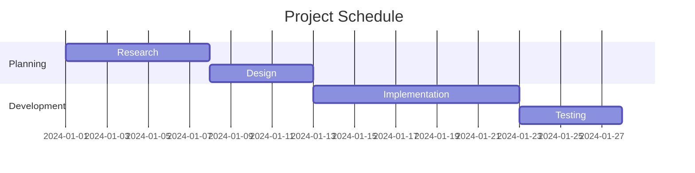

i have no ideas... help me!! 

ok i just made changes... did they save?

# the main idea

- first i do stuff
- next i do other stuff
- save this bitch

What else do i want to write or do?

I dunno... 